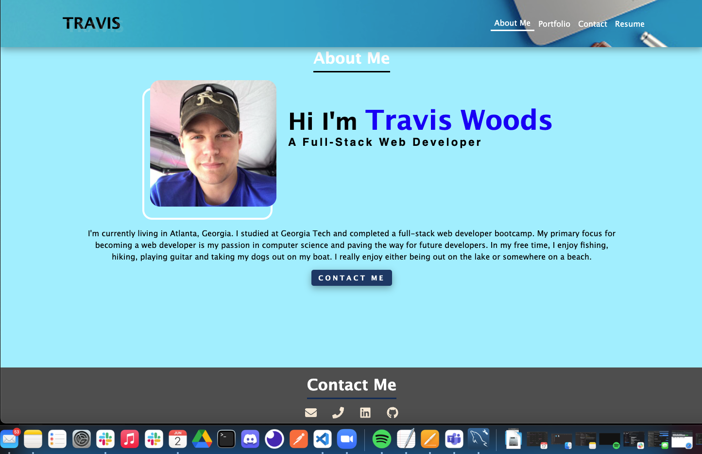

# 20 React: React Portfolio

## Description
  Thank you for visiting my React Portfolio. This app was built using React and displays my growth as a developer. My pages allows the user to look at various projects that I have worked on. It also has a link to my resume and contact information. 

## Table of Contents 

- [Usage](#usage)
- [Contributing](#repo)
- [Credits](#credits)

## Usage
  Check out my React Portfolio!: https://woodstr3313.github.io/react-portfolio/)

  
  

## Credits

[My GitHub: woodstr3313](https://github.com/woodstr3313)

[My react-portfolio GitHub](https://github.com/woodstr3313/react-portfolio)

[My email: woodstr3313@gmail.com](email:woodstr3313@gmail.com)

## How to Contribute
  Please contact me at woodstr3313@gmail.com if you would like to connect with me.

